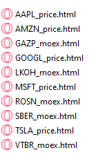
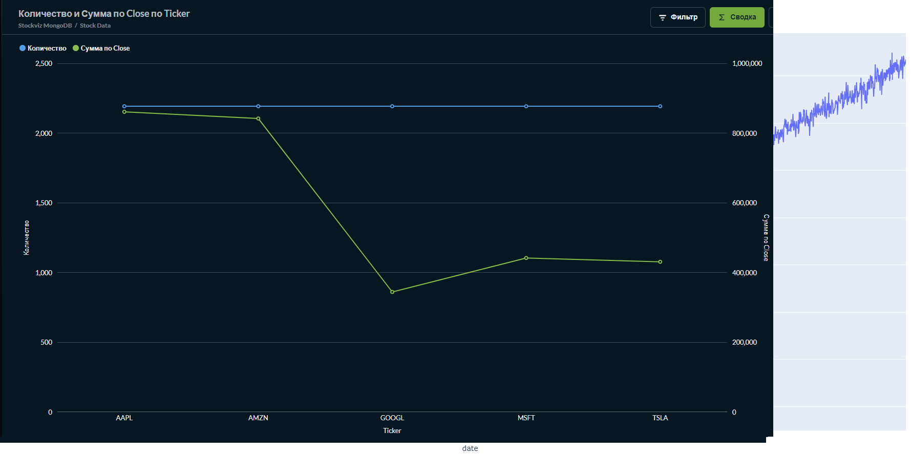

# 📈 Finance Analytics Pipeline — ETL + ML + BI для финансового анализа

[](https://www.python.org/)
[](https://airflow.apache.org/)
[](https://www.mongodb.com/)
[](https://www.postgresql.org/)
[](https://metabase.com/)
[](https://tensorflow.org/)
[](https://www.docker.com/)

**Production-ready ETL/ELT пайплайн** для финансового анализа с автоматической загрузкой данных, расчётом портфельных метрик, прогнозированием цен с помощью LSTM и визуализацией в Metabase.

---

## 📌 Оглавление

- [О проекте](#-о-проекте)
- [Архитектура](#-архитектура)
- [Технологический стек](#-технологический-стек)
- [Быстрый старт](#-быстрый-старт)
- [Структура репозитория](#-структура-репозитория)
- [Модель данных](#-модель-данных)
- [ETL Pipeline (DAG)](#-etl-pipeline-dag)
- [Машинное обучение (LSTM)](#-машинное-обучение-lstm)
- [Визуализация](#-визуализация)
- [Уведомления (Telegram)](#-уведомления-telegram)
- [Скриншоты](#-скриншоты)
- [Планы по развитию](#-планы-по-развитию)
- [Лицензия](#-лицензия)

---

## 🎯 О проекте

Проект решает задачу автоматизации сбора, трансформации и анализа финансовых данных. Основные возможности:

- 🔄 **Автоматический ETL**: загрузка данных из внешних API (MOEX, НБРБ) и генерация тестовых данных
- 📊 **Расчёт портфеля**: ежедневная стоимость, доходность, просадки, VaR
- 🧠 **ML прогнозирование**: LSTM модель для предсказания цен акций
- 📈 **Визуализация**: интерактивные HTML-графики (Plotly) и BI-дашборды (Metabase)
- 🤖 **Уведомления**: Telegram-оповещения о статусе выполнения
- ✅ **Валидация данных**: Pydantic модели для всех типов данных

---

## 🏗️ Архитектура

### Компоненты

| Компонент | Назначение |
|-----------|------------|
| **Airflow** | Оркестрация ETL-пайплайнов |
| **MongoDB** | Горячее хранилище (сырые и обработанные данные) |
| **PostgreSQL** | Холодное хранилище (архив портфеля с TTL 3 дня) |
| **Metabase** | BI-дашборды и визуализация |
| **ML Service** | LSTM прогнозирование (отдельный контейнер) |

### Схема данных
---
 **API** → **Airflow** → **MongoDB** → **ML Service** → **Predictions** → **PostgreSQL** → **Metabase** → **Дашборды** → **Plotly** → **HTML графики**
---

## 🛠️ Технологический стек

| Компонент | Технология | Версия | Назначение |
|-----------|------------|--------|-------------|
| Оркестрация | Apache Airflow | 2.8.1 | Управление ETL-пайплайнами |
| Горячее хранилище | MongoDB | 6.0 | Хранение сырых и обработанных данных |
| Холодное хранилище | PostgreSQL | 15 | Архив портфеля (TTL 3 дня) |
| BI/Аналитика | Metabase | latest | Дашборды и визуализация |
| Машинное обучение | TensorFlow / Keras | 2.13 | LSTM для прогноза цен |
| Валидация данных | Pydantic | 2.5 | Проверка структуры данных |
| Контейнеризация | Docker / Docker Compose | 24.0+ | Изоляция и запуск сервисов |
| Визуализация | Plotly | 5.17 | Интерактивные HTML-графики |

---

## 🚀 Быстрый старт

### Предварительные требования

- Docker Desktop 24.0+
- 8+ GB RAM
- 10+ GB свободного места

### Установка и запуск

```bash
# 1. Клонирование репозитория
git clone https://github.com/VitalyZosimov/Finance_project.git
cd Finance_project

# 2. Запуск всех сервисов
docker compose up -d

# 3. Ожидание инициализации (30 секунд)
sleep 30

# 4. Настройка подключения к MongoDB
docker exec -it airflow_webserver airflow connections add "mongo_default" --conn-type mongodb --conn-host fin_mongo --conn-port 27017 --conn-login mongo --conn-password mongo

# 5. ЗАПУСК ВСЕГО ПАЙПЛАЙНА (ОДНА КОМАНДА!)
docker cp get_all_data.py airflow_webserver:/tmp/
docker exec -it airflow_webserver python /tmp/get_all_data.py

# 6. Запуск ML-сервиса (опционально)
docker compose -f docker-compose.ml.yml up -d
docker exec -it ml_service python /app/train.py
docker exec -it ml_service python /app/predict.py

# Доступ к сервисам

Сервис	                 URL	                Логин	        Пароль
Airflow_UI  	        http://localhost:8080	admin	        admin
Metabase	            http://localhost:3000	(регистрация)	—
MongoDB	                localhost:27017	        mongo	        mongo
PostgreSQL (finance)	localhost:5432	        postgres    	postgres
PostgreSQL (airflow)	localhost:5433	        airflow	        airflow

📁 Структура репозитория

text
Finance_project/
│
├── dags/                               # DAG-файлы Airflow
│   ├── hooks/                          # Кастомные хуки
│   │   ├── mongo_hook.py               # Подключение к MongoDB с валидацией
│   │   └── telegram_hook.py            # Отправка сообщений в Telegram
│   ├── operators/                      # Кастомные операторы
│   │   ├── portfolio_calculator.py     # Расчёт портфеля + архив + графики
│   │   ├── stock_data_generator.py     # Генерация тестовых данных
│   │   ├── moex_equities.py            # Загрузка российских акций (MOEX)
│   │   ├── currency_rates_nbrb.py      # Курсы валют НБРБ (Беларусь)
│   │   └── trigger_ml_predict.py       # Запуск ML прогноза после ETL
│
├── models/                             # Pydantic модели валидации
│   ├── __init__.py
│   ├── stock_data.py                   # Валидация цен акций
│   ├── portfolio_metrics.py            # Валидация портфельных метрик
│   ├── moex_stocks.py                  # Валидация российских акций
│   └── currency_rates.py               # Валидация курсов валют
│
├── ml_service/                         # Отдельный ML-контейнер
│   ├── models/                         # Сохранённые LSTM модели
│   │   ├── lstm_AAPL.h5                # Обученная модель для AAPL
│   │   ├── scaler_AAPL.pkl             # Нормализатор для AAPL
│   │   ├── lstm_MSFT.h5                # Обученная модель для MSFT
│   │   ├── scaler_MSFT.pkl             # Нормализатор для MSFT
│   │   └── ...                         # Аналогично для GOOGL, AMZN, TSLA
│   ├── train.py                        # Обучение LSTM модели
│   ├── predict.py                      # Прогнозирование
│   ├── requirements.txt                # Python зависимости
│   └── Dockerfile                      # Сборка ML-образа
│
├── output/                             # Генерируемые HTML-графики
│   ├── tickers/                        # Графики по отдельным тикерам
│   │   ├── AAPL_price.html             # График цены AAPL
│   │   ├── MSFT_price.html             # График цены MSFT
│   │   ├── GOOGL_price.html            # График цены GOOGL
│   │   ├── AMZN_price.html             # График цены AMZN
│   │   ├── TSLA_price.html             # График цены TSLA
│   │   ├── SBER_moex.html              # График цены Сбербанка (MOEX)
│   │   ├── GAZP_moex.html              # График цены Газпрома (MOEX)
│   │   ├── LKOH_moex.html              # График цены Лукойла (MOEX)
│   │   ├── ROSN_moex.html              # График цены Роснефти (MOEX)
│   │   ├── VTBR_moex.html              # График цены ВТБ (MOEX)
│   ├── currency_rates.html             # Столбчатая диаграмма курсов валют
│   └── portfolio_value_total.html      # Линейный график стоимости портфеля
│
├── screenshots/                        # Скриншоты для README
│   ├── airflow_dags.png
│   ├── aapl_chart.png
│   ├── sber_chart.png
│   ├── currency_rates.png
│   └── portfolio_value.png
│
├── docker-compose.yml                  # Основные сервисы (Airflow, MongoDB, PostgreSQL, Metabase)
├── docker-compose.ml.yml               # ML-сервис (TensorFlow)
├── get_all_data.py                     # Единый скрипт загрузки всех данных и генерации графиков
├── charts.py                           # Скрипт генерации HTML-графиков (отдельно)
├── requirements.txt                    # Python зависимости
├── .env                                # Переменные окружения
└── README.md                           # Документация

📊 Модель данных

MongoDB — горячее хранилище (stockviz)


Коллекция	        Количество	Описание	                                    Валидация
stock_data	        10 960	    Тестовые данные (AAPL, MSFT, GOOGL, AMZN, TSLA)	✅ Pydantic
portfolio_metrics	2 192	    Ежедневная стоимость и доходность портфеля	    ✅ Pydantic
moex_stocks	        155	        Российские акции (SBER, GAZP, LKOH, ROSN, VTBR)	✅ Pydantic
currency_rates	    8	        Курсы валют к BYN	                            ✅ Pydantic
predictions	        5	        LSTM прогнозы	                                ✅ Pydantic


PostgreSQL — холодное хранилище (finance)

Таблица            	Описание	                    TTL	                Валидация
portfolio_archive	Архив портфеля с датой создания	3 дня (автоочистка)	✅ Pydantic


🔄 ETL Pipeline (DAG)

Расписание

DAG	Расписание	Назначение
stock_data_generator	0 */6 * * *	Генерация тестовых данных
portfolio_calculator	30 */6 * * *	Расчёт портфеля + архив + графики + Telegram
moex_equities	0 */6 * * *	Загрузка российских акций (MOEX)
currency_rates_nbrb	0 */6 * * *	Загрузка курсов валют НБРБ
trigger_ml_predict	45 */6 * * *	Запуск LSTM прогноза после ETL

🧠 Машинное обучение (LSTM)

Архитектура модели

text
Input (60 дней)
    ↓
LSTM(50, return_sequences=True)
    ↓
Dropout(0.2)
    ↓
LSTM(50, return_sequences=False)
    ↓
Dropout(0.2)
    ↓
Dense(25, activation='relu')
    ↓
Dense(1) → прогноз цены

Параметры обучения

Параметр	        Значение
Sequence length     60 дней
Train/Test split	80/20
Epochs	            20
Batch size	        32
Optimizer	        Adam
Loss function   	MSE

Сохранённые модели
После обучения в папке ml_service/models/ появляются файлы:
text
ml_service/models/
├── lstm_AAPL.h5      # ~2 MB (веса и архитектура для AAPL)
├── scaler_AAPL.pkl   # ~1 KB (нормализатор для AAPL)
├── lstm_MSFT.h5
├── scaler_MSFT.pkl
├── lstm_GOOGL.h5
├── scaler_GOOGL.pkl
├── lstm_AMZN.h5
├── scaler_AMZN.pkl
├── lstm_TSLA.h5
└── scaler_TSLA.pkl

📊 Визуализация

#Metabase

Подключение к MongoDB:

Host: fin_mongo
Port: 27017
Database: stockviz
User: mongo
Password: mongo

HTML-графики (Plotly)
Автоматически генерируются в папке output/tickers/:

Тип	Файлы	    Что показывает
Тестовые данные	AAPL_price.html, MSFT_price.html, GOOGL_price.html, AMZN_price.html, TSLA_price.html - Динамику цен акций
MOEX (Россия)	SBER_moex.html, GAZP_moex.html, LKOH_moex.html, ROSN_moex.html, VTBR_moex.html	- Динамику цен российских акций
Курсы валют	    currency_rates.html	- Курсы валют к BYN
Портфель	    portfolio_value_total.html	- Стоимость портфеля во времени

🤖 Уведомления (Telegram)
TelegramAlertHook отправляет сообщения при:

✅ Успешном выполнении DAG (on_success_callback)

❌ Ошибке в DAG (on_failure_callback)

Настройка

bash
docker exec -it airflow_webserver airflow variables set bot_token "YOUR_BOT_TOKEN"
docker exec -it airflow_webserver airflow variables set tg_chat_id "YOUR_CHAT_ID"

## 📸 Скриншоты

### 1. Airflow UI — список DAG


### 2. Metabase — MOEX акции (круговая диаграмма)


### 3. Metabase — Stock data (агрегация)


### 4. График TSLA (HTML)


### 5. График GAZP (MOEX)


### 6. Курсы валют к BYN


### 7. Стоимость портфеля


📌 Планы по развитию
Подключение реальных данных через yfinance
Добавление Superset (второй BI-инструмент)
Расширение списка российских акций
Оптимизация LSTM (Grid Search, Early Stopping)
Добавление CI/CD через GitHub Actions
Деплой на облачную платформу (AWS/Azure)

📄 Лицензия
MIT License.

👤 Автор
Vitaly Zosimov
Data Engineer Student

GitHub: @VitalyZosimov
