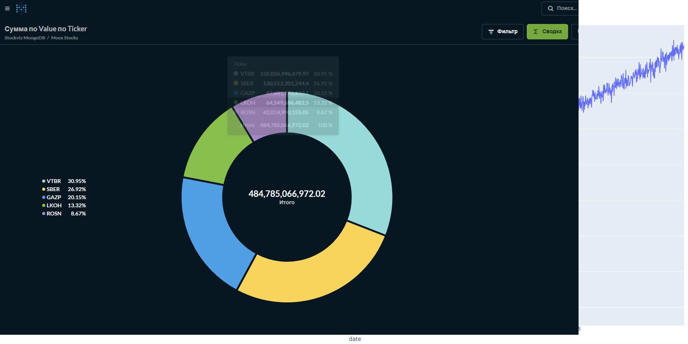
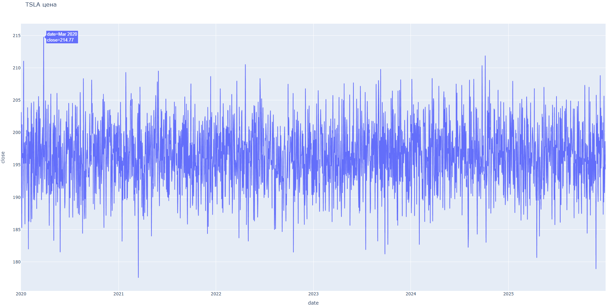
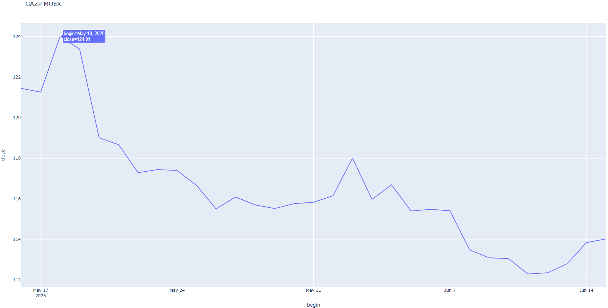
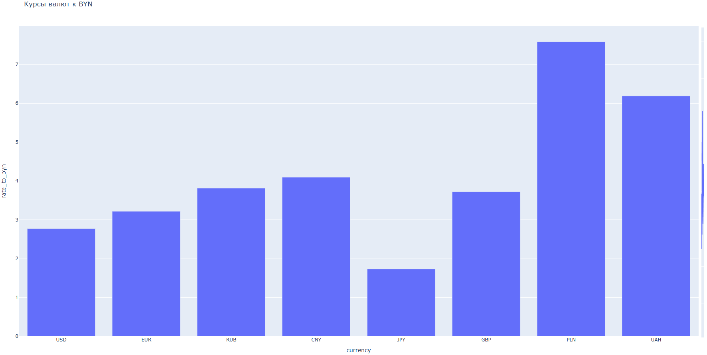
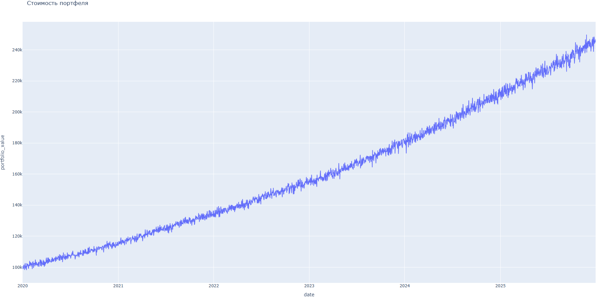

# 📈 Finance Analytics Pipeline — ETL + ML + BI для финансового анализа

[](https://www.python.org/)
[](https://airflow.apache.org/)
[](https://www.mongodb.com/)
[](https://www.postgresql.org/)
[](https://metabase.com/)
[](https://tensorflow.org/)
[](https://www.docker.com/)

**Production-ready ETL/ELT пайплайн** для финансового анализа с автоматической загрузкой данных, расчётом портфельных метрик, прогнозированием цен с помощью LSTM и визуализацией в Metabase.

---

## 📌 Оглавление

- [О проекте](#-о-проекте)
- [Архитектура](#-архитектура)
- [Технологический стек](#-технологический-стек)
- [Быстрый старт](#-быстрый-старт)
- [Структура репозитория](#-структура-репозитория)
- [Модель данных](#-модель-данных)
- [ETL Pipeline (DAG)](#-etl-pipeline-dag)
- [Машинное обучение (LSTM)](#-машинное-обучение-lstm)
- [Визуализация](#-визуализация)
- [Уведомления (Telegram)](#-уведомления-telegram)
- [Скриншоты](#-скриншоты)
- [Планы по развитию](#-планы-по-развитию)
- [Лицензия](#-лицензия)

---

## 🎯 О проекте

Проект решает задачу автоматизации сбора, трансформации и анализа финансовых данных. Основные возможности:

- 🔄 **Автоматический ETL**: загрузка данных из внешних API (MOEX, НБРБ) и генерация тестовых данных
- 📊 **Расчёт портфеля**: ежедневная стоимость, доходность, просадки, VaR
- 🧠 **ML прогнозирование**: LSTM модель для предсказания цен акций
- 📈 **Визуализация**: интерактивные HTML-графики (Plotly) и BI-дашборды (Metabase)
- 🤖 **Уведомления**: Telegram-оповещения о статусе выполнения
- ✅ **Валидация данных**: Pydantic модели для всех типов данных

---

## 🏗️ Архитектура

### Компоненты

| Компонент | Назначение |
|-----------|------------|
| **Airflow** | Оркестрация ETL-пайплайнов |
| **MongoDB** | Горячее хранилище (сырые и обработанные данные) |
| **PostgreSQL** | Холодное хранилище (архив портфеля с TTL 3 дня) |
| **Metabase** | BI-дашборды и визуализация |
| **ML Service** | LSTM прогнозирование (отдельный контейнер) |

### Схема данных
---
 **API** → **Airflow** → **MongoDB** → **ML Service** → **Predictions** → **PostgreSQL** → **Metabase** → **Дашборды** → **Plotly** → **HTML графики**
---

## 🛠️ Технологический стек

| Компонент | Технология | Версия | Назначение |
|-----------|------------|--------|-------------|
| Оркестрация | Apache Airflow | 2.8.1 | Управление ETL-пайплайнами |
| Горячее хранилище | MongoDB | 6.0 | Хранение сырых и обработанных данных |
| Холодное хранилище | PostgreSQL | 15 | Архив портфеля (TTL 3 дня) |
| BI/Аналитика | Metabase | latest | Дашборды и визуализация |
| Машинное обучение | TensorFlow / Keras | 2.13 | LSTM для прогноза цен |
| Валидация данных | Pydantic | 2.5 | Проверка структуры данных |
| Контейнеризация | Docker / Docker Compose | 24.0+ | Изоляция и запуск сервисов |
| Визуализация | Plotly | 5.17 | Интерактивные HTML-графики |

---

## 🚀 Быстрый старт

### Предварительные требования

- Docker Desktop 24.0+
- 8+ GB RAM
- 10+ GB свободного места

### Установка и запуск

```bash
# 1. Клонирование репозитория
git clone https://github.com/VitalyZosimov/Finance_project.git
cd Finance_project

# 2. Запуск всех сервисов
docker compose up -d

# 3. Ожидание инициализации (30 секунд)
sleep 30

# 4. Настройка подключения к MongoDB
docker exec -it airflow_webserver airflow connections add "mongo_default" --conn-type mongodb --conn-host fin_mongo --conn-port 27017 --conn-login mongo --conn-password mongo

# 5. ЗАПУСК ВСЕГО ПАЙПЛАЙНА (ОДНА КОМАНДА!)
docker cp get_all_data.py airflow_webserver:/tmp/
docker exec -it airflow_webserver python /tmp/get_all_data.py

# 6. Запуск ML-сервиса (опционально)
docker compose -f docker-compose.ml.yml up -d
docker exec -it ml_service python /app/train.py
docker exec -it ml_service python /app/predict.py

# Доступ к сервисам

Сервис	                 URL	                Логин	        Пароль
Airflow_UI  	        http://localhost:8080	admin	        admin
Metabase	            http://localhost:3000	(регистрация)	—
MongoDB	                localhost:27017	        mongo	        mongo
PostgreSQL (finance)	localhost:5432	        postgres    	postgres
PostgreSQL (airflow)	localhost:5433	        airflow	        airflow

📁 Структура репозитория

text
Finance_project/
├── dags/
│   ├── hooks/
│   │   ├── mongo_hook.py
│   │   └── telegram_hook.py
│   └── operators/
│       ├── portfolio_calculator.py
│       ├── stock_data_generator.py
│       ├── moex_equities.py
│       ├── currency_rates_nbrb.py
│       └── trigger_ml_predict.py
├── ml_service/
│   ├── models/
│   │   ├── lstm_AAPL.h5
│   │   ├── scaler_AAPL.pkl
│   │   └── ...
│   ├── train.py
│   ├── predict.py
│   ├── requirements.txt
│   └── Dockerfile
├── output/
│   └── tickers/
│       ├── AAPL_price.html
│       ├── AMZN_price.html
│       ├── GOOGL_price.html
│       ├── MSFT_price.html
│       ├── TSLA_price.html
│       ├── SBER_moex.html
│       ├── GAZP_moex.html
│       ├── LKOH_moex.html
│       ├── ROSN_moex.html
│       ├── VTBR_moex.html
│       ├── currency_rates.html
│       └── portfolio_value_total.html
├── docker-compose.yml
├── docker-compose.ml.yml
├── get_all_data.py
└── README.md

📊 Модель данных

MongoDB — горячее хранилище (stockviz)

Коллекция	        Количество	    Описание
stock_data	        10 960	        Тестовые данные (AAPL, MSFT, GOOGL, AMZN, TSLA)
portfolio_metrics	2 192	        Ежедневная стоимость и доходность портфеля
moex_stocks	        155	            Российские акции (SBER, GAZP, LKOH, ROSN, VTBR)
currency_rates  	8	            Курсы валют к BYN
predictions	        5           	LSTM прогнозы

PostgreSQL — холодное хранилище (finance)

Таблица         	Описание	TTL
portfolio_archive	Архив портфеля с датой создания	3 дня (автоочистка)

🔄 ETL Pipeline (DAG)

Расписание

DAG	Расписание	Назначение
stock_data_generator	0 */6 * * *	Генерация тестовых данных
portfolio_calculator	30 */6 * * *	Расчёт портфеля + архив + графики + Telegram
moex_equities	0 */6 * * *	Загрузка российских акций (MOEX)
currency_rates_nbrb	0 */6 * * *	Загрузка курсов валют НБРБ
trigger_ml_predict	45 */6 * * *	Запуск LSTM прогноза после ETL

🧠 Машинное обучение (LSTM)

Архитектура модели

text
Input (60 дней)
    ↓
LSTM(50, return_sequences=True)
    ↓
Dropout(0.2)
    ↓
LSTM(50, return_sequences=False)
    ↓
Dropout(0.2)
    ↓
Dense(25, activation='relu')
    ↓
Dense(1) → прогноз цены

Параметры обучения

Параметр	        Значение
Sequence length     60 дней
Train/Test split	80/20
Epochs	            20
Batch size	        32
Optimizer	        Adam
Loss function   	MSE

📊 Визуализация

#Metabase

Подключение к MongoDB:

Host: fin_mongo
Port: 27017
Database: stockviz
User: mongo
Password: mongo

HTML-графики (Plotly)
Автоматически генерируются в папке output/tickers/:

Тип	            Файлы
Тестовые данные	AAPL_price.html, MSFT_price.html, GOOGL_price.html, AMZN_price.html, TSLA_price.html
MOEX (Россия)	SBER_moex.html, GAZP_moex.html, LKOH_moex.html, ROSN_moex.html, VTBR_moex.html
Курсы валют 	currency_rates.html
Портфель	    portfolio_value_total.html

🤖 Уведомления (Telegram)

TelegramAlertHook отправляет сообщения при:

✅ Успешном выполнении DAG

❌ Ошибке в DAG

Настройка
bash
docker exec -it airflow_webserver airflow variables set bot_token "YOUR_BOT_TOKEN"
docker exec -it airflow_webserver airflow variables set tg_chat_id "YOUR_CHAT_ID"

📸 Скриншоты

HTML-графики в браузере

### 1. Metabase/MOEX


### 2. График TSLA


### 3. График GAZP (MOEX)


### 4. Курсы валют


### 5. Стоимость портфеля


### 6. Metabase Stock data


📌 Планы по развитию
Подключение реальных данных через yfinance
Добавление Superset (второй BI-инструмент)
Расширение списка российских акций
Оптимизация LSTM (Grid Search)
Деплой на облачную платформу

📄 Лицензия
MIT License

👤 Автор
Vitaly Zosimov
Data Engineer Student

GitHub: @VitalyZosimov
